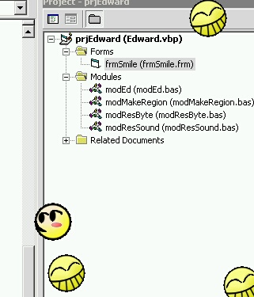



## Radical Edward

### Description

Could be used to pester someone... ;-)

Inspired by the free-wheeling Edward Wong Hau Pepelu Tivrusky 4th; this started out as someone else's project about making various shaped regions... but then it got extremely silly.

A little happy face appears on the screen. When the mouse moves over it it giggles and skitters away, occasionally making a clone of itself.

Project does have some redeeming qualities, like demonstrating how to load gifs and play wave files from a resourse file; and of course the original region code.

Oh, and just hold down the shift key and move over a face to quit the program.

Yay, Edward!
 
### More Info
 

             |
---                |---
**Submitted On**   |2002-11-21 14:16:16
**By**             |[Dan Redding \- Blue Knot Software](https://github.com/Planet-Source-Code/PSCIndex/blob/master/ByAuthor/dan-redding-blue-knot-software.md)
**Level**          |Intermediate
**User Rating**    |4.8 (24 globes from 5 users)
**Compatibility**  |VB 5\.0, VB 6\.0
**Category**       |[Complete Applications](https://github.com/Planet-Source-Code/PSCIndex/blob/master/ByCategory/complete-applications__1-27.md)
**World**          |[Visual Basic](https://github.com/Planet-Source-Code/PSCIndex/blob/master/ByWorld/visual-basic.md)
**Archive File**   |[Radical\_Ed15012211212002\.zip](https://github.com/Planet-Source-Code/dan-redding-blue-knot-software-radical-edward__1-40940/archive/master.zip)

### API Declarations

Yep, plenty.

